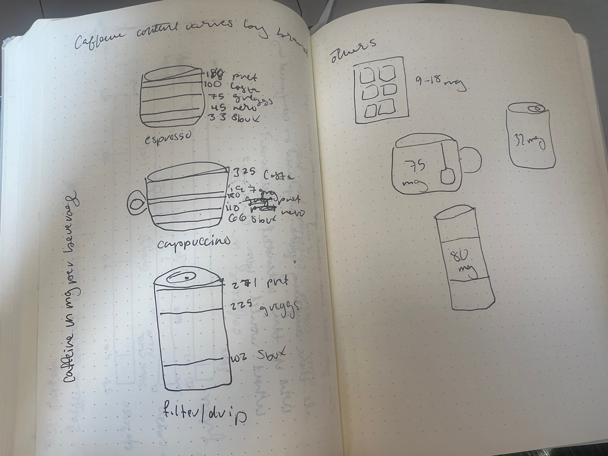
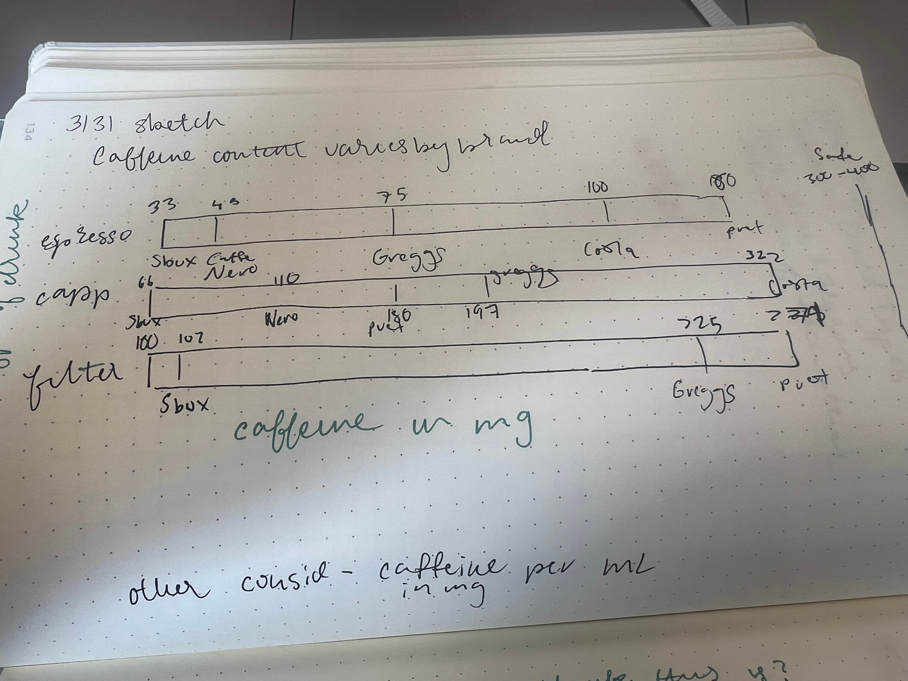

| [home page](https://cmustudent.github.io/tswd-portfolio-templates/) | [data viz examples](dataviz-examples) | [critique by design](critique-by-design) | [final project I](final-project-part-one) | [final project II](final-project-part-two) | [final project III](final-project-part-three) |

# Title
Makeover Monday: Caffeine Levels in High Street Coffee Vary Signficantly, Which? finds

## Step one: the visualization

Here is the link to the original visualization and data source: https://www.which.co.uk/news/article/caffeine-levels-in-high-street-coffees-vary-significantly-which-finds-ay7cA4G1zh1S/

When initially looking at the visualizations, I was drawn to the caffeine content of popular brands, as I was curious if it would confirm some suspicions I had. However, this is UK-based data, so it didn't fully accomplish that. When looking at the initial visualization, it was just a table, leaving not too much to edit, but more to create something from scratch. I knew I wanted to sort everything by brand, and have everything on a spectrum. 

## Step two: the critique

The visualization left a lot to be desired, as the bright blue made it harder to see the text, the data was in a table, and then lots of White, or blue space, was taken up by a graphic of coffee cups, which was cute, but did not contribute to the story of the table or to the overall article. I also think the title of the initial table was not very descriptive. 

I thought the table was mostly useful combined with the article, giving it an 8. I did not think it was complete, as two drinks were missing, and a title with value was missing. It did alright with perceptability and intuitiveness, but would highly benefit from editing. I did not like it aesthetically at all, but the data was truthful and mostly engaging. 

As a devoted coffee drinker, I was drawn to this. I like being able to see varying caffeine contents, and it reaffirms a thought that I had. I did not like the table form -- it's harder to compare numbers without some sort of relating baseline, and I think tables are not always the most intuitive way to display relationships. I think about this more of a spectrum, which is something I would like to see While the left-side graphic was fun, I don't think that it was the best use of space, and I also don't like the blue background -- it's too bright for my eyes, and does't have a high enough text contrast. It also doesn't really serve a purpose -- one UK coffee brand uses blue in their branding, but not that shade. 

The primary audience is High Street (UK-based) chain coffee consumers, especially those who want to monitor their specific caffeine intake. I think it is technically effective as it has the data, but not efficient as there is no standard of comparison for what a good amount of caffeine is in the visualization, just in the body of the text. I think the article title is very striking, and want to incorporate that into the new visualization as well. 

In my initial critique, I wanted to incorporate the suggested amount of daily caffeine intake into the visualization as well, and maybe the caffeine contents of chocolate or other more. I've seen other coffee charts that really lean into the cup visualization, which could be fun but distracting, so I planned to play with some different types. I'm really drawn to a spectrum for this, but I wasn't sure if that would be the easiest to read. 

## Step three: Sketch a solution
Here are my two initial hand sketches, which I presented to my group members for interviews. 

## Step four: Test the solution

I presented both sketches to my teammates, and incorporated most of their feedback.

I asked them what they thought the graphs were showing, which one they preferred, and if they had anything they wished was displayed differently. 

They liked the distinction between the type of drink and the brand, which I decided to keep. In my hand sketches, the brand name and amount of caffeine were on the same line, which they noted caused confusion. They also suggested I think about a bar chart, to show comparison between individual drinks for each brand. They also suggested I incorporate the logos of the brands, but I decided not too as they are not US based brands, and therefore not as recognizable logos to my audience of peers.  My peers were of similar age to myself (early to mid-20s), and in the MSPPM and MISM-BIDA programs, so I had a variety of perspectives different than my own to incorporate. I am grateful for their feedback and ideas!

## Step five: build the solution
Below is my final visualization (created with Datawrapper) 

<iframe title="Starbucks has the least caffeine: comparing caffeine in High street coffee" aria-label="Dot Plot" id="datawrapper-chart-I8yrY" src="https://datawrapper.dwcdn.net/I8yrY/1/" scrolling="no" frameborder="0" style="width: 0; min-width: 100% !important; border: none;" height="204" data-external="1"></iframe>

After conducting interviews, I tried to create my tables in Tableau. I had some difficulties editing my data and my computer is a little finicky
with Tableau, so I decided to switch to Datawrapper, to try the program I was less familiar with, and as my data was not sensitive. I briefly
viewed the Makeover Monday recreations, but was unable to fully watch the video as I was backstage while working. I also decided that I wanted
to tell a slightly different story than the visual in that video, and wanted to present that Starbucks had the least caffeine, rather than what
quantity falls within the safe daily caffeine consumption level that I initially thought I would pursue when filling out my form. 

I made a few changes from my initial thoughts based on peer feedback and my playing with Datawrapper and Tableau. Given my timeframe, I wasn't able to create coffee cup shapes without incorporating some sort of AI, which I generally hesitate to use. I kept my initial spectrum idea, but broke it into brands based on interview feedback. I also color-coded each drink type using red, blue and green, but did not incorporate any coffee colors because shades of brown are hard to distinguish. 

Overall, I think it would've been easier to create something that started with a visualization that wasn't a table. However, I appreciated the challenge, and feel much better about using both Tableau and Datawrapper. 

## References
My data was from Which?, with the below citation:

Loth, Shefalee. “Caffeine Levels in High Street Coffees Vary Significantly, Which? Finds.” Which?, February 1, 2023. https://www.which.co.uk/news/article/caffeine-levels-in-high-street-coffees-vary-significantly-which-finds-ay7cA4G1zh1S/

## AI acknowledgements
I did not use any AI, unless there is any built into Datawrapper that I am not aware of. 

