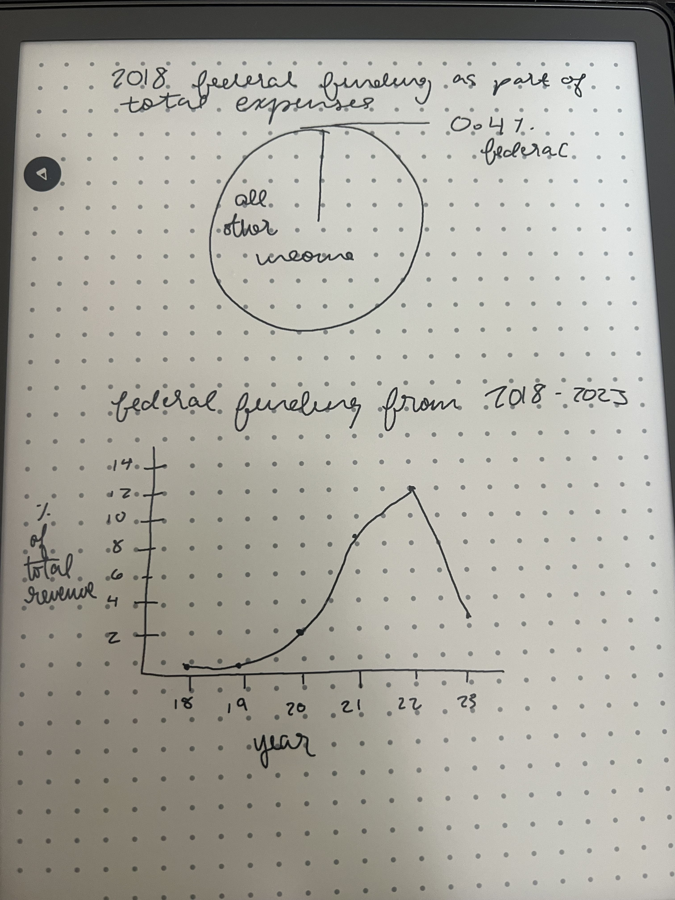

| [home page](https://cmustudent.github.io/tswd-portfolio-templates/) | [data viz examples](dataviz-examples) | [critique by design](critique-by-design) | [final project I](final-project-part-one) | [final project II](final-project-part-two) | [final project III](final-project-part-three) |

# Outline

 There is a lot of fear surrounding federal funding changes and their effects on nonprofit organizations, specifically nonprofit arts organizations. Many nonprofit organizations and their advocates are worried for their futures, but in reality, many nonprofit arts organizations are not majorly reliant on federal funding. I will be looking at historical theatre funding data from TCG's annual theatre facts report, and showing how funding for theates has changed over the past 5 years, and (hopefully) assuaging fears about theatre funding.

 As a lot of theatres received COVID-19 relief funding, recent data demonstrates a higher reliance on federal funding than is actually taking place or has ever taken place, and I hope to debunk this myth in my storytelling. Debunking this myth will tell the story of what's actually happening in theatres and other arts organizations right now. 

I have been studying the effects of the current cultural landscape on censorship practices in theatre for another project, and think that reviewing this data will allow me to complement that knowledge. 

I want my research to demonstrate that theatres are not as reliant on federal funding as a lot of people think they are, and therefore not subject to lots of the anti-DEI rhetoric. To demonstrate this, I want to first show the amount of money that the NEA gives to theatres annually. Then, I want to show that as a very tiny sliver of a pie chart of contributed income, and then an even tinier sliver of all earned and contributed income. 

I also want to do a year-to-year comparison, as people tend to look at 2021 and 2022, see the spike because of relief funding, then panic. I want to demonstrate that spike in a line graph, and then see if I can find any sources of total federal relief given, and demonstrate how small of  a portion the amount given to theatres with these grants was. 

Lastly, I will probably tie something in from my other research about theatre censorship, probably a well-known theatre speaking out against censorship. Tying this in will contribute to my overall goal of preventing as much doom & gloom in theatre makers, as there is significantly less outside control than often realized in many theatres. 

This is a story that is not getting nearly enough attention, and is one causing a lot of anxiety in the field of theatre. Many theatremakers are not aware of how unique the financials of theatres are, and spreading an untrue narrative in a period of greater unrest only negatively contributes to the current state of the field.

## Initial sketches

The above sketches will integrate into my outline. I want to display the total appropriation number, then the number given to TCG member theatres. Then, the 2023 percent of federal funding, the 2018 percent, and the graph of percents from 2018-2023. I will also retain the other categories from the initial data set, but grey them out, so the percent of funding from larger sources is visible. 

# The data

TCG's annual Theatre Facts reports compile publicly-available financial data on member theatres to describe trends. TCG collects this data from publicly available form 990s and SMU Data Arts, a public arts data repository. I will be utlizing TCG's 2023 and 2021 Theatre Facts documents, which will cover the years 2018-2023 (990 tax filings for 2024 are still being reviewed and most aren't due til October). I am utlizing the 2021 report instead of the 2022 report because I want to include data from 2018 (the last full year before any pandemic data factors in), and the 2022 Theatre Facts report link is currently broken. 

While I have not yet compiled the data into my own spreadsheet, I will be converting table 6 on pages 12 and 13 from the 2023 report, and table 6 on pages 11 and 12 from the 2021 report, of average contributed and total income, into a spreadsheet for my personal use. While I could contact TCG directly for the data, as this is the publicly accessible version, I will be following that pathway (noting that they provide this raw data to member theatres and anyone upon request, as it is a compilation of publicly-accessible data). 

| Name | URL | Description |
|------|-----|-------------|
|   2023 TCG Theatre Facts   |  https://docs.google.com/document/d/1okFwp-kxcLBdlA3c3nEolnXNSZbL9nw6e_RaTG3w9Wo/edit?tab=t.0   | 2023 compliation of publicly-available nonprofit theatre finance data |
|   2021 TCG Theatre Facts   |  https://docs.google.com/document/d/1Co-d3NPBOiUfx7bvgTOAydFVvxtHGCNeB2bbAUReYjo/edit?tab=t.0#heading=h.gjdgxs  | 2021 compliation of publicly-available nonprofit theatre finance data |

# Method and medium

I would like to use Shorthand to create my project, but I am unfamiliar with it so will need a good bit of practice time. I anticipate compiling my data in a Google Sheet and then exporting it into a format that will interact well with Shorthand. I want to utilize an interactive dashboard, and would like to stick with Tableau or Power BI, but will play around to see what integrates best with Shorthand. 

## References
Theatre Communications Group, Theatre Facts 2023. Theatre Communications Group, 2025. https://docs.google.com/document/d/1okFwp-kxcLBdlA3c3nEolnXNSZbL9nw6e_RaTG3w9Wo/edit?tab=t.0

Theatre Communications Group, Theatre Facts 2021. Theatre Communications Group, 2023. https://docs.google.com/document/d/1Co-d3NPBOiUfx7bvgTOAydFVvxtHGCNeB2bbAUReYjo/edit?tab=t.0#heading=h.gjdgxs

## AI acknowledgements
I did not use any AI to complete this assignment. 
